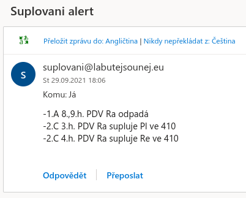

## Suplování alert - SSPŠ

Pokud se na stránkách objeví suplování/odpadání hodiny zadané osoby, pošle se ji e-mail s upozorněním.

Naprosto zbytečné zveřejňovat jako repozitář, gist by postačil, avšak uznávám, nějakou naučnou hodnotu může míti (Obsahuje vysvětlení pro Marka).

Markem schváleno a doceněno. 

## Užití

```bash
# ./suplovani.sh <zkratka> <e-mail>
./suplovani.sh Ke marek.kejda@ssps.cz
```

### suplovani.sh

Níže parsování textu vysvětleno:

```bash
# Načte ssps.cz
curl -s "https://www.ssps.cz/" | 
# Vybere div element se suplováním
awk '/supplementation-report/,/<\/div>/' | 
# Vybere řádek/ky se zadanou zkratkou
grep " $1?*" | 
# Odstraní z řádku html tagy
sed -E 's/(<li>|<\/li>)//g' | 
# Odstraní \r escape znak
tr -d '\r' | 
# Nahradí \n escape znak ;
tr '\n' ';'| 
# Odstraní opakující se mezery
xargs | 
# Odstraní pochybné speciální znaky z Wordu nebo tak něco 
sed 's/\xc2\xa0//g'
```

Níže podmínka vysvětlena:

```bash
# Pokud řetězec suplování není prázdný a zárověň se neshoduje s posledním řádkem logu (zadané osoby) (upozornění o stejném suplování se neodešle vícekrát), poté přidej do logu záznam o suplování a odešli e-mail
if [[ "${suplovani}" != "" && "$(tail -n2 /var/log/suplovani.log | grep "$1" | cut -d ' ' -f3-)" != "${suplovani}" ]]; then
          printf "[$(date '+%d/%m/%Y:%H:%M:%S')] [$1] ${suplovani}\n" >> /var/log/suplovani.log
            echo "${suplovani}" | tr ";" "\n" | sed 's/^ //g' | mail -s "Suplovani alert" -aFrom:suplovani@labutejsounej.eu $2
# Pokudvšak řetězec suplování je prázdný, poté přidej do logu záznam o prázdnosti          
    elif [[ "${suplovani}" == "" ]]; then
              printf "[$(date '+%d/%m/%Y:%H:%M:%S')] [$1] String je null, žádná suplování\n" >> /var/log/suplovani.log
    fi
```

### /var/log/suplovani.log

Log soubor do kterého se ukládají záznamy o suplování, případně jehož absenci. 

Níže příklad:

```
[25/09/2021:13:09:30] [Ot] -2.B 3.h. PDV Ad supluje Ot ve 113; -4.K 3.h. KBB Ra supluje a spojí ve 113 Ot;
[25/09/2021:13:17:15] [Ta] -2.B 4.h. PDV Ad supluje Ta ve 210; -4.K 4.h. KBB Ra supluje a spojí ve 210 Ta;
[25/09/2021:13:18:44] [Ot] -2.B 3.h. PDV Ad supluje Ot ve 113; -4.K 3.h. KBB Ra supluje a spojí ve 113 Ot;
[25/09/2021:13:21:26] [Ta] -2.B 4.h. PDV Ad supluje Ta ve 210; -4.K 4.h. KBB Ra supluje a spojí ve 210 Ta;
[25/09/2021:15:05:26] Testovani ukonceno
[25/09/2021:18:00:04] [Ke] String je null, žádná suplování
[26/09/2021:00:00:08] [Ke] String je null, žádná suplování
[26/09/2021:06:00:01] [Ke] String je null, žádná suplování
[26/09/2021:12:00:07] [Ke] String je null, žádná suplování
[26/09/2021:18:00:08] [Ke] String je null, žádná suplování
[27/09/2021:00:00:08] [Ke] String je null, žádná suplování
[27/09/2021:06:00:07] [Ke] String je null, žádná suplování
[27/09/2021:12:00:07] [Ke] String je null, žádná suplování
[27/09/2021:18:00:09] [Ke] String je null, žádná suplování
[28/09/2021:18:00:07] [Ke] String je null, žádná suplování
```

### crontab entry

Jelikož suplování se na stránkách mění značně nepravidelně a je nutno ho kontrolovat často, manuální spouštění je nepřijatelné. 

Každých 6 hodin tedy bude skript spuštěn.

```
0 */6 * * * /home/user/suplovani.sh <zkratka> <email>
1 */6 * * * /home/user/suplovani.sh <zkratka> <email>
```

## Příklad e-mailu s upozorněním 

